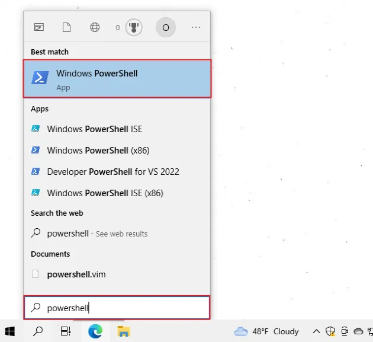
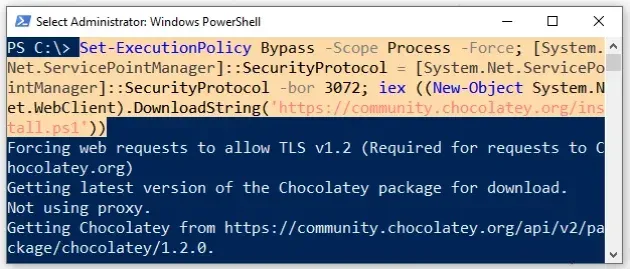
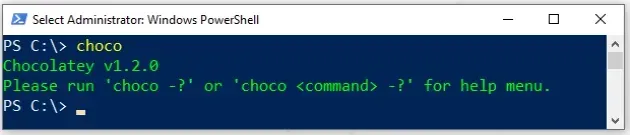
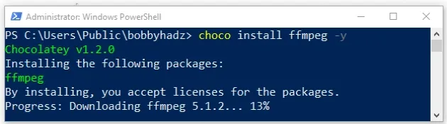
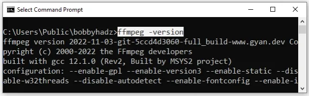

# Discovery Plus Audio Downloader

## Prerequisite Steps
### Install `ffmpeg` on windows.
- Open PowerShell as an administrator.



- Run the following command.
  ```
  Set-ExecutionPolicy Bypass -Scope Process -Force; [System.Net.ServicePointManager]::SecurityProtocol = [System.Net.ServicePointManager]::SecurityProtocol -bor 3072; iex ((New-Object System.Net.WebClient).DownloadString('https://community.chocolatey.org/install.ps1'))
  ```



- Wait for the command to complete.

- Type `choco` to make sure Chocolatey is installed.



Now that you have Chocolatey installed, run the following command to install ffmpeg.
```
choco install ffmpeg -y
```

Note that your shell should still be run using elevated permissions.



Now you should be able to use the `ffmpeg` command.

Click on the Search bar, type `cmd` and start the Command Prompt application.

```
ffmpeg -version
```


For more info: https://bobbyhadz.com/blog/ffmpeg-is-not-recognized-as-internal-or-external-command

## Steps to run
- Open [config.json](config.json)
- Fill `AUDIO_URL` & `LAST_FILE` count value
- Open terminal/command prompt window
- Execute the command
```
node start
```
This command will create temp folder which will contain all audio chunk files.
- Execute the command to compress audio file
```
node convert
```
This command will delete temp folder and create new single audio file.